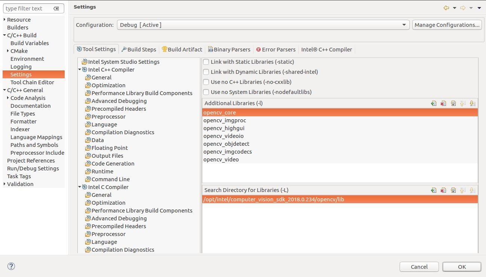
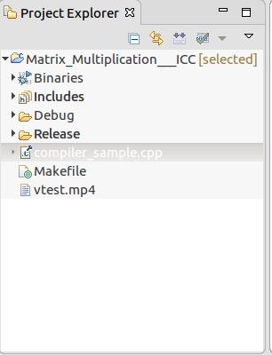
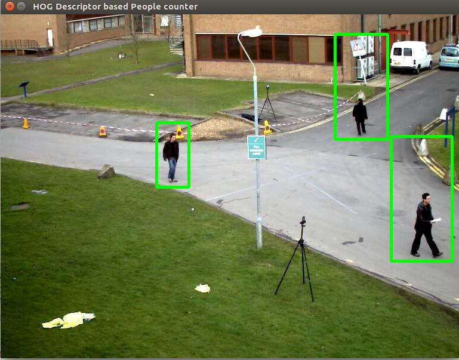
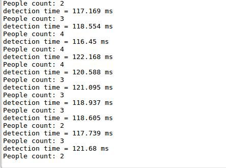

# DISCONTINUATION OF PROJECT #
This project will no longer be maintained by Intel.
Intel has ceased development and contributions including, but not limited to, maintenance, bug fixes, new releases, or updates, to this project.
Intel no longer accepts patches to this project.
# People Counter

| Programming Language |  C++ (Arduino) |
| --- | --- |
| Skills (beg, intermediate, advanced) |  Intermediate |
| Time to complete project (in increments of 15 min) |   |
| Hardware needed (hardware used) | UP Squared* Grove IoT Development Kit, UVC compliant webcam |
| Target Operating System | Ubuntu* 16.04  |

## Introduction

Counts (or measures) the number of people who enter a designated area. You may be familiar with people counting systems, found in small shops, libraries and convenience stores, that use infrared sensors to detect
people. When an infrared beam is cut (a person intercepts it by entering or exiting a door for example) the system increments a count. This technology has limitations when it comes to instances of occlusion (when one person A blocks person B and person B doesn't get counted). An appropriately designed computer vision-based people counting system can be more robust in handling cases of occlusion. Here we utilize the OpenCV libraries and apply the Histograms of Oriented Gradients (HOG) algorithm to create a computer vision application for people detection/counting.

## Gather your materials

-   [UP Squared* Board](http://www.up-board.org/upsquared/)
-   OpenVINO™
-   A UVC webcam
-   Intel® System Studio

## Get the Code

To open the sample, click **people-counter.cpp** in this repository. Copy the entire code.

## Creating a Project

Open Intel® System Studio.

Click File → New → Project → Application Development → C/C++ project to build and run on this Linux* operating system.

Click on the Intel Compiler under Examples and click on ICC example.

Clear the entire code present in .cpp file and paste the code which was copied from Github.

Make the required changes so that no bugs should be there.

### Link the libraries

To link the libraries to the project, click on Project → Properties → C/C++ Build → Settings.

Select the libraries under Intel C++ linker.

Then add the required libraries and path for the libraries as shown below.



Click Apply and then click on OK.

### Including the header files

OpenCV header files must be included to the project as we are using it.

To include the required header files for the project
Click on Project→ Properities → C/C++ General → Paths and Symbols.

Click Add to add the required paths as shown below.


### Build the project

To build the project, click Project → Build Project.

Then a binary will be created if there were no errors as shown below.



## Run the Application

**Note**: Make sure you've plugged in a UVC webcam before attempting to run the application.

To check whether it is working properly or not, click Run → Run As → Local Application.

The output is as shown below:





## How it works

The people detector portion of the code uses Histograms of Oriented Gradients (HOG), a type of "feature descriptor", to achieve object
detection. A feature descriptor (an algorithm) encodes information from an image or video into numerical values. Those values are then used to distinguish one feature from another (to make the task of classification easier).

In the code sample (.cpp file), we initialize the HOG object with ```HOGDescriptor hog;``` and then instruct the HOG object to use a default people counter ```hog.setSVMDetector(HOGDescriptor::getDefaultPeopleDetector());```. 

For each frame in the video capture, we perform the detection of people (our object) with ```hog.detectMultiScale``` (below ```int detectAndDraw(constHOGDescriptor &hog, Mat &img)```) and then a rectangle (green) is drawn around that detected person starting from ```for(size\_t i = 0; i &lt; found.size(); i++ )```. To count the number of rectangles (which corresponds to a detected a person), we use ```int num\_people = detectAndDraw(hog, image)```.

Because we take advantage of an already existing (default) detector (here, we don't actually build an object detector from scratch), we
don't provide an in-depth explanation of the HOG object. Most of the work is taken care of by the OpenCV libraries and that means the sample code is high-level (the details are abstracted from your view as theuser).

## About HOG

Here, "histogram" refers to a distribution (for example, a cluster of similar things, such as edges), "oriented" means directions and
"gradients" refer to x, y derivatives (as in calculus, we’re looking for slopes here). Two types of gradients are used as features: edges (which include curves) and intensity. Curves and edges are the main idea for this type of problem (detection of objects such as people), and for HOG filter approaches in general. A HOG filter is a linear classifier, which means that it’s very good at sorting things into “buckets” based on multi-dimensional features (such as curves and edges).

## Troubleshoot

While building the file in Intel® System Studio if encountered the issue
like 
```unable to find the file libopencv\_core.so.2.4```
This is because the loader is unable to find the shared library location. Then we can solve
the issue by the steps below:

Create a file opencv.conf in /etc/ld.so.conf.d/

Write the path of the particular library in the opencv.conf file.

Then run 
```sudo ldconfig -v```


